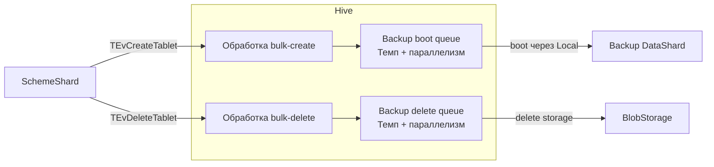

# RFC: Сглаживание пиков нагрузки при экспорте резервных копий

## Проблема

Экспорт больших таблиц может создавать пики нагрузки на SchemeShard, Hive, Interconnect и дисковую подсистему при подготовке backup-копий и их удалении, увеличивая задержки пользовательских запросов.

## Краткое описание решения

Предлагается сократить обмен сообщенями между SchemeShard и Hive за счёт пакетного создания и удаления таблеток, вынести основную массу их создания и запуска в `PrepareCopyTable`, а также ограничить темп и параллелизм операций на этапах запуска, передачи и установки snapshot и очистки storage. `CopyTable` использует заранее подготовленные таблетки с сохранением общей точки консистентности; параллелизм чтения и выгрузки в S3 регулируется существующим Resource Broker. Ожидаемый результат - сглаживание пиков и снижение влияния export на пользовательскую нагрузку при возможном увеличении времени экспорта.

## Предлагаемое решение

1. Создание backup-таблиц и метаданных таблеток (`PrepareCopyTable`): добавить `TEvCreateTablet` для bulk create ограниченными пачками, группируя таблетки по `ObjectId`, чтобы уменьшить поток сообщений между SchemeShard и Hive.

2. Запуск пустых backup-таблеток (`PrepareCopyTable`): завести отдельную boot queue для  backup-таблеток и ограниченными пачками контролируемо (например, дожидаясь запуска всех таблеток из предыдущего батча или ограничивать количество запусков в секунду) производить запуски.

3. Начало согласованного копирования (`CopyTable`): использовать уже подготовленные таблетки, добавляя недостающие после split и удаляя лишние после merge.

4. Формирование, передача и установка snapshot (`CopyTable`): вводить отдельное ограничение параллелизма в DataShard/SchemeShard, сохраняя общую точку консистентности: по аналогии с п2 через очередь растянуть передачу snapshot-ов во времени. Так как копирование shapshot-ов происходит не очень долго, это не должно сильно увеличить время `CopyTable`.

5. Выгрузка в S3: это уже ограничивается через Resource Broker (queue_backup).

6. Удаление backup-таблиц после выгрузки: использовать bulk delete (`TEvDeleteTablet`) ограниченными пачками, уменьшая количество управляющих запросов и ответов (аналогично п1).

7. Остановка таблеток и очистка их storage: применять очередь для размазывания удаления во времени (как в п2).

## Протоколы и контракты между компонентами

- Добавление нового поля `Count` в `TEvCreateTablet` — новый bulk-create API: ограниченный список описаний таблеток и результат для каждого элемента; сохраняются `(Owner, OwnerIdx)`, `ObjectId` и `IsBackup`, повторы не создают дубликаты.
- `PrepareCopyTable` ждёт готовности созданных таблеток после прохождения backup boot queue, а не только ответа о создании метаданных.
- Для bulk-delete используется существующий `TEvDeleteTablet` со списком шардов; в SchemeShard добавляется обработка списочных ответов и повторов, включая перенаправления. `OK` означает принятие удаления; backup delete queue отдельно ограничивает delete storage.
- Окно передачи snapshot — отдельное изменение в SchemeShard/DataShard, не часть Hive: слот удерживается до надёжной установки snapshot, общая точка снимка и защита его частей сохраняются.

Ниже показаны изменения на пути создания и удаления; очереди внутри Hive — логические, с ограничениями темпа и параллелизма.

## Конфигурация и ограничения

- **Bulk create/delete:** отдельные максимальные размеры пачек, а также число запросов в работе на пару SchemeShard–Hive.
- **Backup boot queue (Hive):** темп запуска в таблетках/с, допустимый кратковременный всплеск (`burst`), число одновременно стартующих backup-таблеток на Hive и на ноду. Эти ограничения не отменяют общие лимиты запуска и приоритет обычных таблеток.
- **Передача snapshot (SchemeShard/DataShard):** максимальное число одновременно копируемых пар source–destination на SchemeShard. Слот удерживается до надёжной установки snapshot на destination, а не только до отправки сообщения.
- **Backup delete queue (Hive):** отдельные темп, `burst` и число одновременно выполняемых удалений storage. Backup-удаления занимают ограниченную часть общего окна `MaxDeleteTabletInProgress`, оставляя ёмкость для обычных удалений.
- **Выгрузка в S3:** используются существующие настройки Resource Broker для `queue_backup`; они ограничивают параллелизм backup-задач.

Начальные значения выбираются по нагрузочным тестам. Уменьшение лимитов может увеличить время `PrepareCopyTable`, передачи snapshot в `CopyTable`, удержания snapshot и всего export.

## Отказоустойчивость и восстановление

- **`PrepareCopyTable` (база SchemeShard):** новый сохраняемый жизненный цикл предсозданного набора backup-таблеток: ожидает готовности после запуска, подготовлен и ожидает `CopyTable`, передан в `CopyTable` либо требует очистки.
- **Окно snapshot (база SchemeShard):** для каждой пары source–destination, привязанной к общей точке снимка, состояние допуска: ожидает, допущена к передаче, установка подтверждена DataShard. Допуск фиксируется до отправки команды; незавершённые допуски используются при восстановлении занятых слотов.
- **Очереди Hive (память):** отдельные backup boot/delete очереди. Восстановление опирается на существующие состояния таблеток и `IsBackup`, точный порядок очереди не сохраняется.

## Совместимость

Новый режим экспорта в целом не совместим: меняются внутренние протоколы и состояния операций.

Предлагается общий фичефлаг `EnablePacedBackupExport` (по умолчанию `false`).

## Наблюдаемость

- **Backup boot/delete и окно snapshot:** размер очереди, возраст старейшей записи, занятые слоты, фактический темп и причины ограничения.
- **Bulk create/delete:** число пачек, их размер и длительность обработки.
- **`PrepareCopyTable`:** длительность этапа, число подготовленных таблеток и оставшихся до готовности.

## Рассмотренные альтернативы

- **Ограниченный пул переиспользуемых DataShard:** вместо backup-таблетки на каждую партицию создать фиксированное число DataShard. Каждый последовательно подключает очередной state, выгружает его в S3, освобождает контекст и переключается на следующий без пересоздания таблетки. Это сокращает число созданий, запусков и удалений, но требует реализации переключения контекстов DataShard.
- **Новый тип backup-таблетки:** хранит состояния и прогресс экспорта исходных шардов, а чтение snapshot и выгрузку в S3 выполняет через ограниченный пул параллельно работающих акторов, без создания отдельного backup-DataShard на каждую партицию.

## Открытые вопросы

Какое увеличение времени `PrepareCopyTable`, `CopyTable` и всего export считаем приемлемым ради сглаживания пиков?